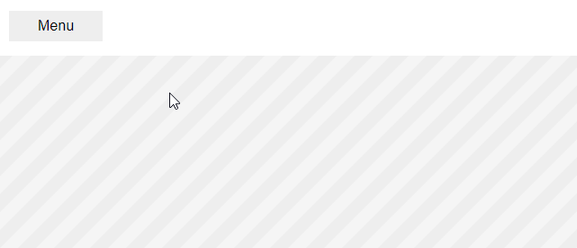

# Tiny Drawer

*Version 1.2*

Really small mobile menu navigation sliding in from the left.

## In short

- Only 1kb
- Vanilla JS
- Zero dependencies
- Super simple setup
- Callback support
- No content wrapper needed
- Remember scroll position on close



*The real thing is much smoother than this animated gif*

## Usage

It just can't get any simpler than this. There is also an example in `index.php`.

### CSS

```html
<link rel="stylesheet" href="assets/css/dist/core.min.css">
```

### HTML

```html
<drawer-menu>Put your menu here</drawer-menu>
<div data-drawer-open>Trigger to open menu</div>
```

### JS

```html
<script>
TinyDrawer.init();
</script>
```

## Options

### replacement

To prevent possible collision with other scrips you change `drawer` in data attributes to something else.

```js
TinyDrawer.init({
  replacement: 'drawer'
});
```

*Be aware! If you change this option, you also need to match it in the css file.*

### drawer-selector

```js
TinyDrawer.init({
  drawerSelector: 'drawer-menu'
});
```

*Be aware! If you change this option, you also need to match it in the css file.*

### callback

If you need to trigger other actions when the menu state changes, you can use a callback.

- `element` is the element that triggered the change.
- `action` is `open` or `close` depending on what happends.

```js
TinyDrawer.init({
  callback: function(element, action) {
    console.log(element);
    console.log(action);
  }
});
```

## HTML methods

## Open

```html
<div data-drawer-open>Trigger to open menu</div>
```

## Close

```html
<div data-drawer-close>Trigger to open menu</div>
```

## JS methods

### open

If you need to programmically trigger the menu to open you can use this method.

```js
TinyDrawer.open();
```

### close

If you need to programmically trigger the menu to close you can use this method.

```js
TinyDrawer.close();
```

## Other information

### How to style it

The important CSS that is needed for the component to work is put directly on the data attributes and the custom elements. However, if you want to add additional CSS to it, it's highly recommended to add a class to that element to separate the core CSS from the custom CSS.

### Why the use of data attributes

While classes or ids could be used for actions, I use data attributes instead. That way you can add your own classes that you can style separated from the logic.

### Why the use of custom elements

I could use a div with an id but all major browsers now supports custom elements. To make it really visible that it is a component, it's a custom element and not just a div.

## Donate

Donate to [DevoneraAB](https://www.paypal.me/DevoneraAB) if you want.

## License

MIT